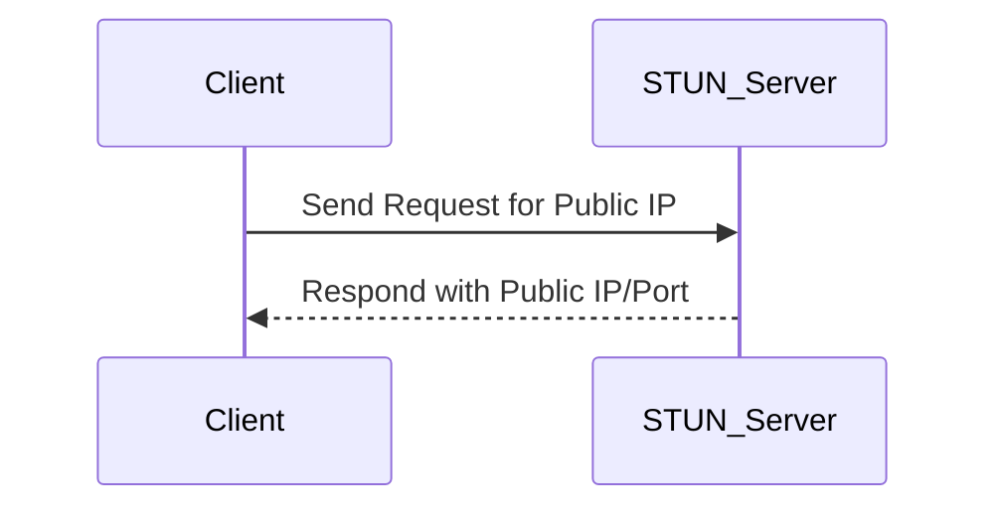
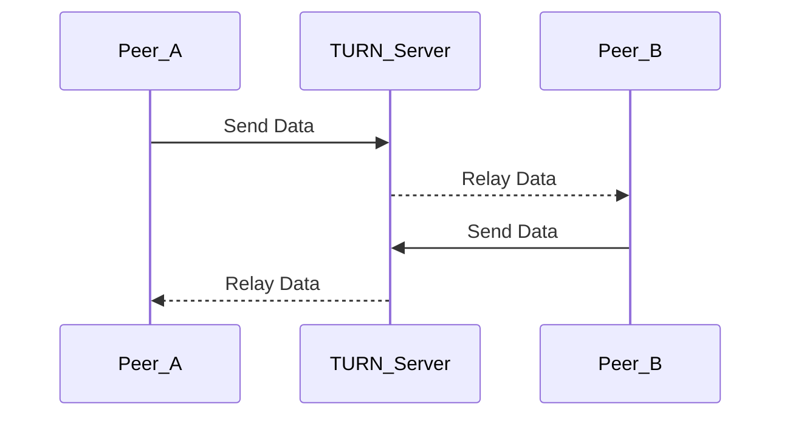

# WebRTC

- [01. Introduction to WebRTC](#01-introduction-to-webrtc)
- [02. Core Concepts of WebRTC](#02-core-concepts-of-webrtc)
- [03. Setting Up a WebRTC Connection](#03-setting-up-a-webrtc-connection)
- [04. WebRTC Signaling](#04-webrtc-signaling)
- [05. Understanding WebRTC APIs](#05-understanding-webrtc-apis)
- [06. WebRTC Data Channels](#06-webrtc-data-channels)
- [07. Understanding STUN and TURN Servers](#07-understanding-stun-and-turn-servers)
- [08. WebRTC Security Considerations](#08-webrtc-security-considerations)
- [09. WebRTC Media Streams](#09-webrtc-media-streams)
- [10. WebRTC NAT Traversal](#10-webrtc-nat-traversal)
- [11. WebRTC Error Handling](#11-webrtc-error-handling)
- [12. WebRTC Bandwidth Management](#12-webrtc-bandwidth-management)
- [13. WebRTC Testing and Debugging](#13-webrtc-testing-and-debugging)
- [14. WebRTC Scalability](#14-webrtc-scalability)
- [15. Best Practices for WebRTC Implementation](#15-best-practices-for-webrtc-implementation)
- [16. WebRTC Interoperability Challenges](#16-webrtc-interoperability-challenges)
- [17. WebRTC Future Trends](#17-webrtc-future-trends)
- [18. WebRTC Troubleshooting](#18-webrtc-troubleshooting)
- [19. WebRTC Performance Optimization](#19-webrtc-performance-optimization)
- [20. WebRTC Case Studies and Applications](#20-webrtc-case-studies-and-applications)

## 01. Introduction to WebRTC

WebRTC, which stands for Web Real-Time Communication, is a technology
that allows voice, video, and data sharing between browser clients
(peers). It is designed to work within web pages, allowing direct
interaction without requiring installation of additional plugins. This
powerful and flexible tool can help developers create applications that
enable peer-to-peer connections and communications with ease.

WebRTC is widely used for applications like video conferencing,
telephony, live streaming, and file sharing. It is an open-source
project maintained by Google and supported by a wide range of major
browsers including Chrome, Firefox, Safari, and Edge.

Key components of WebRTC include real-time audio and video capture,
encoding/decoding, transmission via peer-to-peer connections, and
working with network traversal technologies to penetrate NATs and
firewalls.

To get started with WebRTC, developers typically need to understand the
various APIs provided, such as `RTCPeerConnection`, `RTCDataChannel`,
and `getUserMedia`. These APIs allow access to media devices, manage
data transfers, and establish real-time communication channels between
browsers.

In essence, WebRTC empowers developers to interact naturally with
users, enabling seamless experiences across web platforms.

## 02. Core Concepts of WebRTC

WebRTC, or Web Real-Time Communication, is a technology that enables peer-to-
peer connections directly between web browsers. By using WebRTC, you can
achieve audio, video, and data sharing capabilities without the need for
intermediate servers. To understand WebRTC, let's explore its core concepts:

### 1. Peer Connection

A peer connection represents a connection between two endpoints, such as two
browsers. This connection allows the exchange of audio, video, and data.

### 2. Media Stream

Media stream refers to the streaming of audio and video content. WebRTC
handles media streams with ease, enabling live transmission between peers.

### 3. Signaling

Signaling involves the exchange of information essential for establishing a
peer connection. This includes session details like codecs and network data.
WebRTC does not define a standard signaling method, giving developers
flexibility to choose.

### 4. STUN and TURN Servers

- **STUN (Session Traversal Utilities for NAT)** helps with establishing
  connectivity between peers behind NATs (Network Address Translation).
- **TURN (Traversal Using Relays around NAT)** acts as a relay server for
  media when direct connectivity is not achievable.

These concepts form the foundation for building real-time communication
applications using WebRTC. Understanding them is the first step towards
designing efficient and robust WebRTC solutions.

## 03. Setting Up a WebRTC Connection

In this article, we will explore the basic steps to establish a WebRTC
connection. A WebRTC connection typically involves the exchange of media
streams between browsers or applications directly, providing real-time
communication capabilities. Here's a step-by-step guide to achieving this:

### Understanding the Signaling Process

The signaling process is crucial in setting up a WebRTC connection. It
enables both peers to exchange connection setup information and negotiate
the parameters of the communication. Signaling itself is not part of WebRTC,
and you'll need to implement this via an external method like WebSocket or
HTTP APIs.

1. **Gathering ICE Candidates**

   - Interactive Connectivity Establishment (ICE) candidates are essentially
     network addresses that identify how the peers can connect to each other.
     During the connection process, both peers gather these candidates.
     Network traversal efforts, including NAT, are handled via Session
     Traversal Utilities for NAT (STUN) or Traversal Using Relays around NAT
     (TURN) servers.

2. **Creating an Offer**

   - One peer starts the connection by creating an `RTCSessionDescription`
     offer, describing the media capabilities it wants to send and receive.
     This offer is shared via the signaling channel.

3. **Receiving and Answering the Offer**

   - The recipient of the offer sets the received offer as a remote
     description. It then creates an answer using `RTCSessionDescription`,
     describing its own capabilities, and sends it back through the
     signaling channel.

4. **Exchanging ICE Candidates**

   - Both peers continue to exchange ICE candidates until the most efficient
     path is determined, and the connection is established.

5. **Establishing a Peer Connection**
   - Once both the offer and answer are shared, and ICE candidates are
     exchanged, the peers establish a direct connection, allowing for the
     real-time exchange of media and data.

Setting up a WebRTC connection requires a solid understanding of these
steps to enable effective and efficient real-time communication.

## 04. WebRTC Signaling

In this article, we'll explore the signaling process in WebRTC. Signaling
is a crucial step in establishing a WebRTC peer-to-peer connection. It
involves the exchange of control messages that enable peers to discover
each other, exchange session descriptions, and communicate network
information like IP addresses and ports.

### What is Signaling?

Signaling in WebRTC is not defined by the standard and doesn't transmit
the media itself. Rather, it is a process that helps in setting up the
actual media channels. You can implement signaling using any method,
such as WebSockets, HTTP, or any preferred communication protocol.

### Signaling Process

The signaling process involves several steps:

1. **Offer/Answer Exchange**: One peer creates an offer, and the other
   peer provides an answer. This process helps each peer to understand
   the desired media parameters and network information.

2. **ICE Candidate Exchange**: Peers exchange ICE (Interactive
   Connectivity Establishment) candidates, enabling them to establish
   a direct connection through NAT/firewalls.

### Implementing Signaling

Since WebRTC does not specify how signaling should be done, developers
have flexibility in choosing the preferred method and technology. Common
approaches include:

- **WebSockets**: Persistent connections that allow for quick and
  dynamic message exchanges between peers.

- **HTTP**: Though not as dynamic as WebSockets, HTTP can also be used
  for signaling, mainly in simpler applications.

#### Example

Here's an example of how signaling might look using WebSockets:

```javascript
// Peer A creates an offer
let peerConnection = new RTCPeerConnection();
peerConnection
  .createOffer()
  .then((offer) => {
    return peerConnection.setLocalDescription(offer);
  })
  .then(() => {
    // Send the offer to Peer B via WebSocket
    ws.send(JSON.stringify({ offer: peerConnection.localDescription }));
  });

// Peer B receives the offer and sends an answer
ws.onmessage = (message) => {
  let data = JSON.parse(message.data);
  if (data.offer) {
    peerConnection.setRemoteDescription(new RTCSessionDescription(data.offer));
    peerConnection
      .createAnswer()
      .then((answer) => {
        return peerConnection.setLocalDescription(answer);
      })
      .then(() => {
        // Send the answer to Peer A
        ws.send(JSON.stringify({ answer: peerConnection.localDescription }));
      });
  }
};
```

This example demonstrates a simple signaling process using JavaScript
WebSockets, facilitating the establishment of a WebRTC connection.

## 05. Understanding WebRTC APIs

WebRTC provides a suite of APIs that allow developers to easily integrate
real-time communication capabilities into web applications. These APIs
handle everything from establishing connections to controlling media streams.

### Key WebRTC APIs

1. **RTCPeerConnection**

   - Manages connections to other clients.
   - Handles operations like creating and maintaining sessions.

2. **RTCDataChannel**

   - Facilitates peer-to-peer data exchange.
   - Enables bi-directional communication between peers.

3. **MediaStream**
   - Represents media inputs like video and audio streams.
   - Controls track manipulation and processing.

### RTCPeerConnection

RTCPeerConnection is the primary interface for connecting to remote peers.

#### Basic Operations

- **Create Offer/Answer**: Begin negotiation by creating and sending session
  descriptions.
- **Set Remote Description**: Configure peer connection with remote session
  information.
- **Add Ice Candidate**: Manage network traversal by providing connectivity
  candidates.

### RTCDataChannel

Used for non-media data transfer, RTCDataChannel supports various use cases,
from gaming to file sharing. It operates over the established RTCPeerConnection.

- **Reliable or Unreliable Delivery**: Developers can choose between reliable
  delivery and low-latency delivery modes.
- **Message Order**: Controls whether messages must be received in order.

### MediaStream

The MediaStream interface represents synchronized streams of media content.

- **Tracks**: Consist of video or audio tracks that can be manipulated.
- **Capture**: Use navigator.mediaDevices.getUserMedia to capture streams
  from cameras or audio devices.

Understanding these APIs is crucial for effectively implementing WebRTC-based
communication in your web applications. By learning how to utilize these
interfaces, you can create seamless real-time communication experiences.

## 06. WebRTC Data Channels

WebRTC provides a mechanism for transmitting arbitrary data directly between
browsers via data channels. This functionality complements audio and video
streaming, making WebRTC a versatile tool for peer-to-peer communication.

### What are WebRTC Data Channels?

Data channels are an integral part of WebRTC, enabling efficient transmission
of non-media data. They support features like text messaging, file transfer,
and even more complex applications such as gaming data synchronization.

### Benefits of WebRTC Data Channels

- **Low Latency**: Data channels are designed to be fast, ensuring minimal
  transmission delays.
- **Congestion Control**: Similar to SCTP (Stream Control Transmission
  Protocol), data channels handle congestion effectively to maintain
  efficient data flow.
- **Security**: Data transmitted through WebRTC is inherently secure, with
  encryption baked into the protocol.
- **Flexibility**: Supports both reliable and unreliable data transfer,
  making it suitable for various application needs.

### Creating a WebRTC Data Channel

Creating and using data channels via WebRTC APIs involves:

1. **Establishing a Peer Connection**: Before using data channels, a peer
   connection must be set up between the clients.
2. **Creating Data Channel**: Use `RTCPeerConnection.createDataChannel`
   method.
   ```javascript
   const dataChannel = peerConnection.createDataChannel("myDataChannel");
   ```
3. **Configuring the Channel**: Options such as ordered, maxRetransmits can
   be configured when creating a data channel.
4. **Event Handling**: Implement event handlers for open, close, error, and
   message events on the data channel to manage communication efficiently.

### Use Cases for WebRTC Data Channels

- **Real-time Collaboration**: Allows users to collaborate in real-time (e.g.,
  editing documents, shared whiteboards).
- **Online Gaming**: Facilitates fast and efficient data exchange, which is
  crucial for gaming.
- **IoT Communication**: Enables remote control and data telemetry from IoT
  devices.
  -Secure File Transfer: Offers a direct and secure way for sharing files between
  users.

In the next article, we will delve into advanced topics related to data
channel optimization and use in complex applications.

## 07. Understanding STUN and TURN Servers

WebRTC requires the use of STUN (Session Traversal Utilities for NAT) and
TURN (Traversal Using Relays around NAT) servers to facilitate
peer-to-peer connections.

### STUN Servers

STUN servers assist a WebRTC-based app to find out its public IP address
and determine any restrictions behind a NAT. This process helps in
building a link between peers who are behind routers/firewalls.

#### How STUN Works

1. **Request:** The client sends a request to a STUN server.
2. **Response:** The server responds with the public IP and port.

STUN is mainly used for NAT traversal in the context of VoIP and
other UDP communications. It allows discovering the public address and
port assigned by the NAT. This is crucial for setting up direct
peer-to-peer UDP communication channels.



### TURN Servers

TURN servers are used when STUN fails. They relay data between parties
when direct peer connections are not possible, such as when a symmetric
NAT is involved.

#### When to Use TURN

TURN is essential when:

- Both parties are behind restrictive NATs/firewalls.
- Direct connection is otherwise unachievable.

TURN ensures that there is a fallback method to communicate when a
direct P2P connection fails, usually by relaying the entire call/media
session through the TURN server. This can incur additional latency and
cost.



Understanding these servers' roles in WebRTC can significantly impact
the reliability and performance of a peer-to-peer connection. Ensuring
your application has access to both STUN and TURN servers ensures
maximum connectivity success under various network conditions.

## 08. WebRTC Security Considerations

WebRTC (Web Real-Time Communication) provides a powerful and flexible
means to handle voice, video, and data exchange. But as with any web
technology, security is a critical concern. Understanding WebRTC
security considerations will help developers build more secure
applications.

### End-to-End Encryption

In WebRTC, media streams use Secure Real-time Transport Protocol (SRTP),
which provides encryption, message authentication, and integrity. SRTP
ensures that media streams are protected against eavesdropping and
modification.

### ICE and NAT Traversal Security

The Interactive Connectivity Establishment (ICE) framework is
responsible for NAT traversal. WebRTC works over UDP, which can make
it susceptible to IP spoofing. WebRTC security requires careful
handling of ICE candidates.

### Data Channel Security

WebRTC data channels use Datagram Transport Layer Security (DTLS)
underneath, providing confidentiality, authenticity, and integrity
protection.

### Authentication and Authorization

Proper authentication of peers is essential. WebRTC does not directly
define how authentication is performed but relies on the server side
to authenticate users. Similarly, developers must implement
authorization to control who can access specific media streams or data.

### Preventing Man-in-the-Middle Attacks

WebRTC's use of DTLS for encryption helps to prevent man-in-the-middle
attacks. To enhance security, you should ensure that all sessions
begin with certificate validation and verification.

### Browser and Environment Security

As WebRTC often operates in browsers, taking browser security into
account is essential. Be sure that your application complies with
best security practices to protect against vulnerabilities and make use
of Content Security Policy (CSP) headers.

Understanding these key aspects of WebRTC security will better equip
any developer looking to leverage this powerful platform. Keeping
security at the core of WebRTC development practices ensures safer
and more robust communication solutions for users.

## 09. WebRTC Media Streams

WebRTC supports real-time audio and video communication over web browsers. A
core concept in WebRTC is the use of media streams, which consist of tracks
such as video or audio. Media streams are fundamental to enabling rich media
communication features.

### MediaStream Interface

The `MediaStream` interface represents a stream of media content. It can
contain several tracks, each representing an individual video or audio feed.
These tracks can be accessed and manipulated using JavaScript.

#### Creating MediaStreams

You can create a `MediaStream` in several ways:

- From a local media device using `getUserMedia()`.
- By merging other existing `MediaStreams`.

#### Example: Accessing Webcam Video

Here's a simple example of accessing a user's webcam:

```javascript
navigator.mediaDevices
  .getUserMedia({ video: true })
  .then(function (stream) {
    // `stream` is a MediaStream object
    let videoTracks = stream.getVideoTracks();
    let audioTracks = stream.getAudioTracks();

    console.log("Using video device: " + videoTracks[0].label);
    console.log("Using audio device: " + audioTracks[0].label);
  })
  .catch(function (error) {
    console.error("Error accessing media devices.", error);
  });
```

#### Controlling Tracks

Each track within a `MediaStream` can be individually controlled. For instance,
you can mute/unmute audio, pause/resume video, or even replace a track.

##### Muting Audio

```javascript
stream.getAudioTracks()[0].enabled = false; // Mutes the audio
```

### Practical Use Cases

- Video conferencing platforms use media streams to handle multiple video/audio
  feeds.
- Online gaming and virtual reality can leverage these streams for immersive
  experiences.

### Browser Compatibility

WebRTC's `MediaStream` API enjoys wide support across modern browsers, including
Chrome, Firefox, Edge, and Safari.

Media streams pave the way for high-quality multimedia communication in the
browser, providing flexibility and power to developers to build innovative
applications.

## 10. WebRTC NAT Traversal

WebRTC is designed to work seamlessly across different network types
while establishing direct connections between devices. NAT (Network
Address Translation) Traversal is a key concept in this capability,
helping devices connect despite being behind routers that translate
private IP addresses to a public address.

#### Why NAT Traversal is Needed

Most home and office networks use NAT to allow multiple devices to access
the internet through a single public IP address. While this is efficient,
it creates challenges for peer-to-peer communication like WebRTC, as
devices outside the network don't know how to directly reach a device
behind a NAT.

#### STUN and TURN Protocols

NAT Traversal for WebRTC often involves STUN (Session Traversal Utilities
for NAT) and TURN (Traversal Using Relays around NAT) servers.

- **STUN Server**: This helps discover the public IP and port number
  assigned by the NAT, key for establishing a direct peer-to-peer
  connection.

- **TURN Server**: When a direct connection fails, a TURN server
  relays the media between peers, essentially acting as a middleman.

#### Ice Candidates

WebRTC uses the ICE (Interactive Connectivity Establishment) framework
which tries to find the best path to connect peers, gathering multiple
ICE candidates (potential connection paths). It prioritizes these
candidates and attempts a connection using each until successful.

#### Challenges and Solutions

- **Symmetric NATs**: Some NAT configurations are more complex,
  requiring advanced routing or reliance on TURN servers.

- **Network Policies**: Corporate or strict networks may block certain
  ports, impacting NAT traversal, which might require configuration
  or use of specific proxies.

NAT traversal is crucial for WebRTC applications to ensure they work
smoothly across diverse network environments. Understanding NAT
mechanisms and properly implementing STUN and TURN servers is key to
building resilient WebRTC applications.

## 11. WebRTC Error Handling

Error handling in WebRTC is vital for creating robust applications.
Developers must account for possible failures in communication,
disconnected peers, and unexpected behaviors.

### Common Error Scenarios

1. **ICE Connection Failures**: Occur when peers cannot establish a
   connection due to network issues or incorrect configurations.
2. **Signaling Errors**: Arise when signal messages are not properly
   exchanged or processed.

3. **Media Device Errors**: Happen when there are no permissions or
   the devices are busy/unavailable.

4. **Network Changes**: Dynamic changes in network conditions can
   disrupt ongoing streams and connections.

### Handling Errors

- **Use Events**: WebRTC provides events like `oniceconnectionstatechange`
  to detect state changes and handle errors promptly.
- **Implement Timeouts/Retries**: Set specific timeout and retry
  mechanisms for critical operations.

- **Graceful Degradation**: Adjust quality or switch to alternative
  paths to maintain usability when errors occur.

- **Logging and Reporting**: Employ logging to investigate errors and
  improve future detection and handling.

### Tools for Debugging

WebRTC's built-in statistics API can help monitor the state and
performance of connections to catch and analyze errors effectively.

## 12. WebRTC Bandwidth Management

WebRTC is built to transmit real-time media over networks. The challenge lies in
managing bandwidth, as media requires different amounts based on resolution,
content, and network conditions.

WebRTC uses several techniques for effective bandwidth management:

1. **Adaptive Bitrate**: WebRTC automatically adjusts the bitrate of the media
   stream to match the current network conditions. This means it can decrease the
   quality in case of poor network conditions or increase it when the conditions
   improve.

2. **Congestion Control**: WebRTC implements congestion control mechanisms like
   Google's Congestion Control (GCC) to avoid overwhelming network capacity,
   ensuring smooth delivery by reducing the stream quality when the network is
   congested.

3. **Bandwidth Estimation**: WebRTC continuously estimates the available
   bandwidth using RTCP (Real-Time Transport Control Protocol) reports and adjusts
   the media stream accordingly for optimal performance.

4. **Codec Selection**: Choosing the right codec can impact bandwidth usage.
   WebRTC supports various codecs, enabling it to select the appropriate one based
   on network conditions and device capabilities.

These techniques ensure a balance between media quality and network
utilization, making WebRTC suitable for various network environments.

Understanding and configuring these bandwidth management strategies is crucial
for developers to optimize WebRTC applications for diverse usage scenarios.

## 13. WebRTC Testing and Debugging

Testing and debugging WebRTC applications are crucial steps in ensuring
that they function correctly across different networks and devices.
Given the complexity of real-time communication, varied network behaviors,
and the need for seamless media streaming, developers must thoroughly test
and debug their WebRTC solutions.

#### WebRTC Testing Tools

1. **TestRTC**: A cloud-based testing service specifically designed for
   WebRTC. It provides automated testing, load testing, and monitoring
   capabilities.

2. **WebRTC Internals**: Available in modern browsers like Chrome, this
   tool offers detailed insights into the WebRTC sessions, gathering data
   such as connection stats, media stats, and any errors that may occur.

3. **Wireshark**: Useful for analyzing network traffic, Wireshark helps
   you inspect the signaling and media data exchanged during a WebRTC
   session.

#### Common Debugging Techniques

- **Console Logging**: Leveraging `console.log()` to track the flow and
  values of your WebRTC application.

- **Network Analysis**: Use tools to capture and analyze network
  packets. Ensure that STUN and TURN servers are operational and that
  ICE candidates exchange happens as expected.

- **Stats API**: WebRTC offers a `getStats()` API that provides detailed
  performance metrics, allowing you to monitor statistics like packet
  loss, jitter, and round-trip time.

#### Troubleshooting Common Issues

- **Connection Fails**: Verify signaling server, check ICE candidates,
  and ensure the STUN/TURN servers are working correctly.

- **Poor Quality Media**: Inspect bandwidth allocation, network
  constraints, and media codec configuration.

- **Audio/Video Sync Issues**: Check encoding settings and try
  different codec parameters.

By employing robust testing and debugging practices, developers can
create resilient WebRTC solutions that deliver high-quality real-time
communications across varied environments.

## 14. WebRTC Scalability

Scalability in WebRTC is essential for handling a large number of users
and connections simultaneously. Challenges often arise due to the
decentralized nature of peer-to-peer connections. Achieving scalability
requires the implementation of methods such as:

1. **Selective Forwarding Units (SFUs):** These are media servers that
   forward all or part of the traffic to various recipients without
   mixing the streams, reducing load on end-user devices.

2. **Multipoint Control Units (MCUs):** In contrast to SFUs, MCUs mix
   video and audio streams from various sources into a single stream
   which it then routes to all participants.

3. **Load Balancing:** Using proper load balancing techniques can
   ensure that no single server is overwhelmed, distributing the traffic
   efficiently.

4. **Optimizing Signaling Processes:** Improving the way signaling is
   done, for quicker connections and efficient handling of multiple
   users.

5. **Efficient Bandwidth Management:** Proper bandwidth management
   practices such as employing adaptive bitrate streaming help in
   maintaining quality without consuming unnecessary resources.

As WebRTC usage continues to grow in complex applications, scalability
systems will evolve to meet demand more robustly and flexibly, helping
to maintain system performance and user experience.

## 15. Best Practices for WebRTC Implementation

WebRTC offers a powerful framework for real-time communication, but implementing
it effectively requires adherence to best practices. This article details some
essential strategies for optimizing your WebRTC applications.

### Optimize Bandwidth Usage

Efficient bandwidth use is crucial for minimizing lag and maximizing video
quality. Implement adaptive bitrate streaming and prioritize audio over video
when bandwidth is constrained.

### Security Practices

Ensure end-to-end encryption for all media streams and data channels. Regularly
update your WebRTC libraries to protect against known vulnerabilities.

### Handle Network Variability

Use techniques like Forward Error Correction (FEC) to handle packet loss and
jitter. Implementing jitter buffers can also help in maintaining a smooth
playback of streams.

### Effective Signaling

Efficient signaling helps in fast connection setups and reduces latency. Optimize
signaling servers performance and ensure they are correctly scaled for load.

### Monitor Quality of Service (QoS)

Implement real-time monitoring to assess network quality and dynamically adjust
parameters. Use metrics like jitter, latency, and packet loss to maintain high
QoS.

### Cross-Platform Compatibility

Ensure your WebRTC application is tested across various platforms and
environments. Consider using polyfills or libraries that abstract differences in
implementation.

By adhering to these best practices, you can ensure robust, secure, and
efficient WebRTC implementations that provide a seamless user experience.

## 16. WebRTC Interoperability Challenges

WebRTC is a powerful tool for real-time communication, but like any
technology, it comes with its own set of challenges, especially when it
comes to interoperability. Different browsers and devices may handle
WebRTC differently, making it crucial to understand these potential
compatibility issues and how to address them.

### Mixed Codec Support

One of the primary interoperability challenges is codec support. WebRTC
owes much of its functionality to the codecs it employs, such as VP8,
VP9, and H.264 for video, as well as Opus for audio. However, different
browsers may have varying levels of support for these codecs.

For example, some browsers may prefer VP8 due to its open-source nature,
while others may prioritize H.264 due to its broader adoption in
enterprise environments. Ensuring all participating browsers and devices
can negotiate and agree on a common codec is crucial for a smooth
connection.

### Variations in API Implementations

While WebRTC relies on standardized web APIs, variations in these
implementations can occur. Browsers may implement certain WebRTC APIs
differently, leading to potential inconsistencies in functionality.
Developers must stay updated on the latest specifications and test
across various browsers to mitigate these issues.

### Network Behavior

Different network environments can also affect WebRTC's performance. For
instance, network NAT types and firewall configurations can vary,
potentially impacting the ability to establish peer-to-peer connections.

Ensuring robust STUN and TURN server configurations can help navigate
these network-related interoperability issues. Continuous monitoring and
adaptive network strategies can also improve the WebRTC experience
especially in less predictable environments.

### Browser and Device Incompatibilities

Browser version discrepancies and device-specific quirks may affect
WebRTC. Therefore, thorough cross-platform testing is essential.

Consider fallback mechanisms and polyfills for broader compatibility, as
well as responsive design approaches to cater to the diversity of
devices and browsers.

### Conclusion

Addressing WebRTC interoperability challenges involves staying updated
with the latest standards, careful testing, and adopting flexible
strategies in codec negotiation, network management, and API
implementation. By doing so, developers can deliver a consistent and
reliable real-time communication experience across different platforms
and devices.

## 17. WebRTC Future Trends

WebRTC has become an integral part of real-time communication (RTC)
landscape, evolving rapidly to meet the demands of modern applications
such as video conferencing, live streaming, and gaming. In this article,
we will explore the future trends that are likely to shape the WebRTC
technology and its adoption.

### Evolution of Browser Support

WebRTC continues to receive strong support from all major browsers,
including Chrome, Firefox, Safari, and Edge. In future, we can expect
further optimization and enhancements in browser APIs to leverage
WebRTC's capabilities more effectively, driving even lower latencies
and improved media handling.

### Integration with AI and ML

Artificial Intelligence (AI) and Machine Learning (ML) are transforming
the way we interact with technologies. WebRTC will likely see a surge
in integration with AI and ML, enabling more advanced media processing,
voice recognition, and predictive QoS, enhancing user experiences in
real-time communication scenarios.

### Growth in IoT Applications

The Internet of Things (IoT) opens new opportunities for leveraging
WebRTC. As IoT devices become more prevalent, WebRTC can play a
critical role in connecting these devices through real-time RTC
protocols, supporting expanded functionality and creating seamless
user experiences across various IoT environments.

### Expansion of AR and VR Applications

Augmented Reality (AR) and Virtual Reality (VR) are areas where WebRTC
holds great potential. As AR and VR technologies improve, WebRTC can
facilitate real-time communication, driving adoption in innovations
like remote teamwork, virtual events, and interactive entertainment.

### Enhancements in QoS and QoE

As demand for high-quality RTC increases, further advancements in
Quality of Service (QoS) and Quality of Experience (QoE) for WebRTC
applications are anticipated. These improvements will focus on reducing
latency, improving bandwidth utilization, and enhancing media quality
for an optimized end-user experience.

### WebRTC in Edge Computing

The move towards edge computing presents new opportunities for WebRTC
in optimizing data processing and transmission. Edge computing can
support WebRTC applications by minimizing latency and offering local
data processing, catering to IoT and distributed network requirements.

### Increased Use in Telehealth

Telehealth has emerged as a critical application for real-time RTC
technologies. WebRTC's capabilities in providing secure and seamless
communication make it ideal for telehealth solutions, offering remote
consultations, virtual care, and continuous patient monitoring.

## 18. WebRTC Troubleshooting

WebRTC applications, while powerful, can encounter a variety of issues.
Effective troubleshooting is essential to ensure smooth and reliable communication.
In this article, we'll discuss common problems that arise in WebRTC
applications and provide strategies for troubleshooting.

### Common Issues

Here are some of the common issues you might encounter:

1. **Connection Failures**: Often related to NAT traversal problems or
   signaling issues.
2. **Poor Quality**: Audio or video quality may degrade due to bandwidth
   constraints or incorrect encoding settings.
3. **Latency and Lag**: This could be caused by network issues or heavy
   processing loads.
4. **Security Warnings**: Possible misconfigurations in secure connections.
5. **Browser Compatibility**: Not all WebRTC features are supported uniformly across
   browsers.

### Troubleshooting Strategies

- **Network Monitoring**: Use network tools to monitor and diagnose issues such as
  packet loss, jitter, and latency.
- **Logging**: Implement detailed logging in your application to track events
  and errors.
- **STUN/TURN Server Check**: Ensure that your STUN and TURN servers are correctly
  configured and responding.
- **Cross-Browser Testing**: Thoroughly test your application across different
  browsers and devices.
- **Code Inspection**: Review the code for incorrect implementation of WebRTC APIs.

### Tools and Resources

- **Wireshark**: For packet capture and analysis.
- **WebRTC-internals**: Chrome's built-in tool to inspect WebRTC connections.
- **Monitoring Solutions**: Such as Twilio's Monitoring, which can be integrated
  into WebRTC applications to track performance and quality metrics.

Troubleshooting requires a systematic approach to isolate the problem
effectively and ensure your application runs smoothly. Mastery of these
techniques will help mitigate issues promptly and improve user experience.

## 19. WebRTC Performance Optimization

WebRTC performance can be crucial for real time communication,
especially in terms of latency and quality. Here is a guide to
optimizing WebRTC for better performance.

### 1. Monitor Network Conditions

Monitor the network conditions continuously to adapt the quality
of streams. WebRTC offers mechanisms like bandwidth estimation
which help in making informed adjustments.

### 2. Optimize Codec Usage

Use efficient codecs like VP8/VP9 for video and Opus for audio.
The choice of codec impacts both the quality and the required
bandwidth.

### 3. Adjust Bitrate Dynamically

Dynamic bitrate adjustments can help maintain quality without
increasing latency. This can be achieved by detecting network
congestion and reacting accordingly.

### 4. Reduce Latency

Minimize delays by ensuring rapid packet delivery. Use techniques
such as congestion control to maintain low latency.

### 5. Improve Video Quality

Implement video processing techniques, such as denoising and
deblocking, to enhance user experience.

### 6. Leverage Hardware Acceleration

Utilize hardware acceleration for tasks such as encoding and
decoding to improve performance and reduce CPU usage.

### 7. Use Efficient Data Channels

Data channels should be optimized for low-latency delivery,
especially in applications such as gaming and file transfer.

Properly configuring, managing, and regularly assessing these
aspects can lead to notably improved WebRTC performance.

## 20. WebRTC Case Studies and Applications

WebRTC has been successfully implemented in various real-world applications,
bringing robust real-time communication capabilities to a wide range of
industries. In this article, we'll explore case studies and applications where
WebRTC has played a pivotal role in transforming communication.

### Case Study 1: Video Conferencing

Video conferencing platforms are one of the most prominent users of WebRTC.
WebRTC's support for high-quality audio and video connections in browsers has
made it a staple for platforms like Google Meet, Microsoft Teams, and Zoom.
These platforms rely on WebRTC to deliver seamless HD video calls without
requiring users to install additional plugins.

### Case Study 2: Telehealth Solutions

The healthcare industry benefits immensely from WebRTC by enabling secure,
encrypted connections for telehealth consultations. Companies like Doxy.me and
Teladoc leverage WebRTC to provide patients with direct connections to
healthcare providers, facilitating remote diagnostics and care.

### Case Study 3: E-commerce and Retail

WebRTC is being used to offer live customer support through video chats on
e-commerce websites. Platforms like Amazon and Alibaba use WebRTC to connect
customers with service representatives, improving the shopping experience and
increasing conversion rates.

### Case Study 4: Education and E-Learning

WebRTC has transformed remote learning by enabling interactive virtual
classrooms. Platforms like Coursera and Khan Academy utilize WebRTC to allow
students and teachers to engage in real-time discussions and video lessons,
bridging geographic gaps.

### Emerging Applications

- **Augmented Reality (AR) and Virtual Reality (VR):** With the rise of AR and
  VR, WebRTC's real-time capabilities offer promising possibilities in creating
  immersive experiences.

- **IoT Devices and Smart Homes:** WebRTC plays a role in connecting smart
  devices, allowing real-time video communication through security cameras and
  home automation systems.

### Conclusion

WebRTC's adaptability and robust set of features have made it indispensable
across various industries. By enabling secure, high-quality real-time
communication, WebRTC continues to pave the way for innovative solutions and
opportunities. As technology progresses, new applications of WebRTC are likely
to emerge, transforming the way we connect and communicate worldwide.
